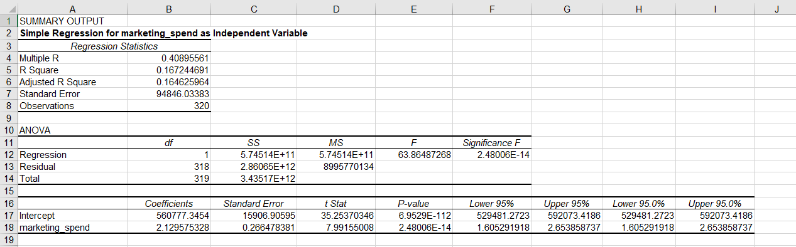
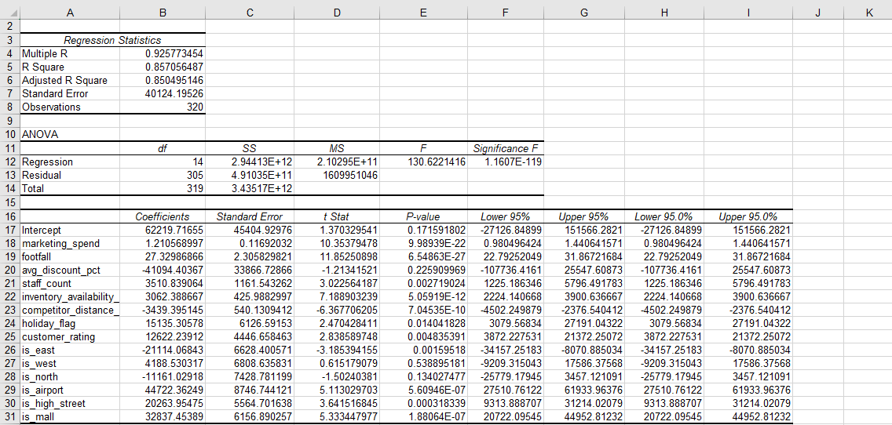
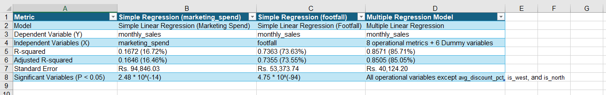

# Part 3: Regression-Based Business Insights & Model Interpretation

### 1. Business Problem Summary
To find and understand what factors are driving monthly sales performance across stores. And Brainstorming business actions such as increasing marketing spend, improving inventory availability, changing discounting strategy, reallocating staff, and prioritizing certain store types or regions.  

We use regression analysis to identify which factors appear most strongly associated with monthly sales and provide a business recommendation.  
________
### 2. Dataset Description
**(Task 1: Dataset Review)**

1. **Numerical Variables**  
    - ***Continuous:*** `marketing_spend`, `avg_discount_pct`, `inventory_availability_pct`, `competitor_distance_km`, `customer_rating`, `monthly_sales`, `monthly_profit`.
    
    - ***Discrete/Integer:*** `footfall`, `staff_count`.  

2. **Categorical Variables**  
    - ***Nominal/Text:*** `region` (East, West, North, South), `store_type` (Airport, High Street, Mall, Residential).

    - ***Binary (Indicator):*** `holiday_flag` (0 or 1).  

4. **Variables Requiring Cleaning or Transformation**  
    - `competitor_distance_km` (6 blanks): Blanks are filled with the **overall median** = 3.365.

    - `customer_rating` (8 blanks): Blanks are filled using the **average rating** for that store's **specific store_type** (High Street = 3.8, Mall = 3.9 and Residential = 3.9).

    - `region`: New Dummy Variable columns (`is_east`, `is_west`, `is_north`) are created using binary (0/1) indicators. "South" is left out as the reference baseline.

    - `store_type`: New Dummy Variable columns (`is_airport`, `is_high_street`, `is_mall`) are created using binary (0/1) indicators. "Residential" is left out as the reference baseline.

5. **Variables Not Useful for Regression**  
    - `store_id`: A unique identifier carries no statistical or behavioral value. Hence ignored.

    - `month`: A text identifier (yyyy-mm). The raw text dates cannot be used directly in the regression matrix.

    - `monthly_profit`: It is not used as an independent variable to predict monthly_sales. Profit is directly derived from sales (Profit = Sales - Expenses).

________
### 3. Dependent and Independent Variables
1. **Dependent Variable (Y)**  
`monthly_sales`: This is our primary outcome variable. It represents the total sales performance of a store in a given month and is what we aim to predict and explain using the model.  

2. **Potential Independent Variables (X)**  
`marketing_spend`, `footfall`, `avg_discount_pct`, `staff_count`, `inventory_availability_pct`, `competitor_distance_km`, `holiday_flag`, `customer_rating`.  
________
### 4. Regression Approach
**Simple Linear Regression (Model 1):** Examined marketing_spend to calculate marketing return on investment (ROI).

**Simple Linear Regression (Model 2):** Examined footfall to establish relationship between physical traffic volume and retail sales.

**Multiple Linear Regression (Model 3):** Evaluated all 14 independent predictors simultaneously. This model calculates the impact of each individual variable while holding all other variables perfectly constant, preventing the distortion of omitted variable bias.

________
### 5. Dummy Variable Approach
To include qualitative text attributes (such as Region and Store Type) in a mathematical model, these fields were converted into binary Dummy Variables.

To prevent data redundancy and avoid the "Dummy Variable Trap", one category from each group was omitted to become the reference baseline.  

**Reference Categories Selected:**
- Regional Baseline: South
- Store Type Baseline: Residential  

This represents a Residential store type located in the South region during a non-holiday month.
________
### 6. Model Comparison Summary
The following table shows the summary of the 3 models side by side.

_________
### 7. Final Model Selected
The Multiple Linear Regression Model was selected as the final model for:  
- The simple marketing spend model explains only 16.72% of sales, and the footfall model explains 73.63%. The multiple regression model captures 85.71% of all monthly sales variation. This makes it safer and more accurate for decision making.  
- The Standard Error drops from Rs. 94,846 to Rs. 40,124. Using the multiple regression model reduces errors by over half. This reduces risk.
_________
### 8. Business Recommendations
- Implement a policy to ensure inventory availability across all stores never drops below a certain point.

- Instead of pouring funds strictly into marketing (which yields a modest but statistically significant return of Rs. 1.21 for every Rs. 1 spent), shift budget toward core in-store operations.

- For underperforming stores, increase inventory depth, add 1 floor staff member, and target localized reputation fixes to lift review ratings by at least 0.5 stars.
_________
### 9. Assumptions and Limitations
- While the model captures 85.71% of variance, the remaining 14.29% contains unmeasured elements like hyper-local marketing campaigns, localized economic shocks, regional disposable income shifts, and specific landlord constraints.

- Linear regression models assume straight-line growth indefinitely. In reality, adding 50 staff members or reaching 200% inventory depth will not continuously grow sales. The model cannot identify where saturation or diminishing returns hit.
________